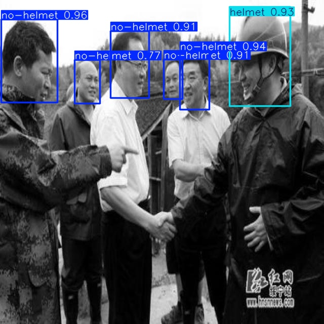
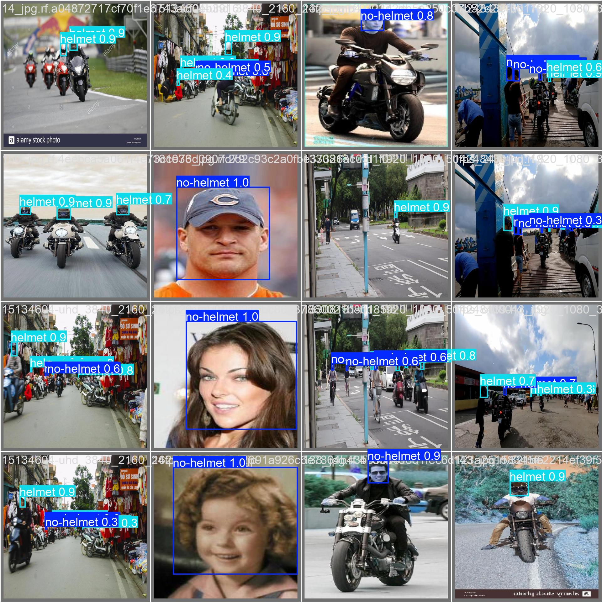
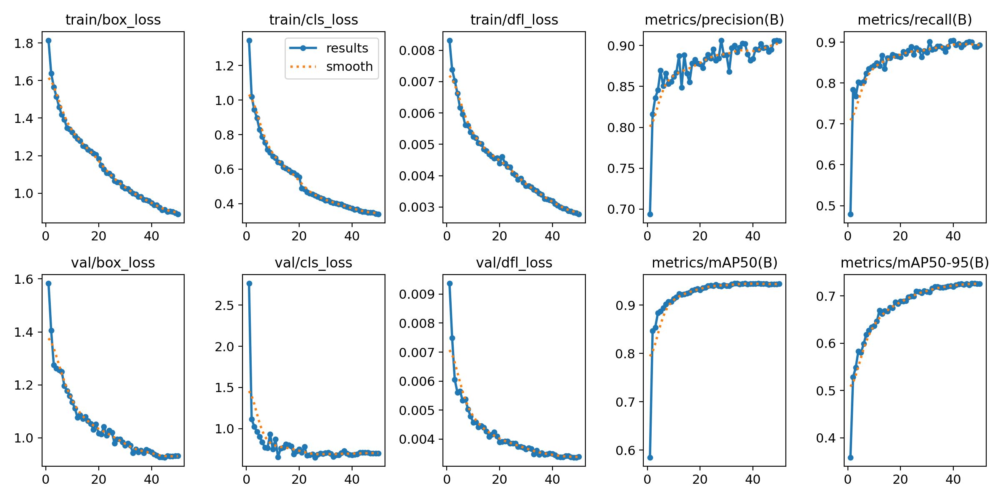
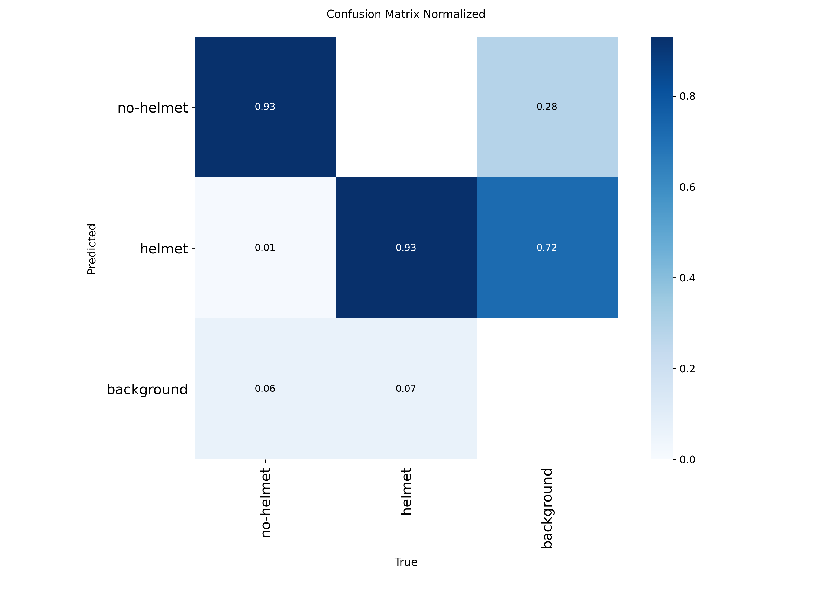

<h1 align="center"> 🧢 HELMET DETECTION SYSTEM</h1> 
     

---

<h2>📘 Project Overview</h2> 
 This project builds a <strong>real-time Helmet vs No-Helmet detection system</strong> using a YOLO-based object detection model. The goal is to automate helmet compliance monitoring in traffic surveillance systems. 
 
 The project follows a complete <strong>end-to-end computer vision lifecycle</strong>: Data Preparation → Model Training → Evaluation → Real-Time Inference → API Deployment → Dockerization. 

---

<h2>🎯 Problem Statement</h2> 
 Manual monitoring of helmet compliance is inefficient and prone to human error. An automated detection system enables: 
 <ul> <li>🚦 Real-time traffic monitoring</li> <li>📊 Automated violation detection</li> <li>🛡️ Improved road safety enforcement</li> <li>⚡ Scalable smart-city deployment</li> </ul>

---

<h2>✨ Key Features</h2> <ul> <li>🧠 YOLO-based Object Detection</li> <li>📹 Live Webcam Monitoring</li> <li>🎥 Video File Processing</li> <li>⚙️ Adjustable Confidence Threshold</li> <li>📊 FPS Counter & Real-Time Metrics</li> <li>📦 Best Model Checkpointing</li> <li>🌐 FastAPI Inference Service</li> <li>🐳 Dockerized Deployment</li> </ul>

---

<h2>🧩 Tech Stack</h2> <table> <tr> <td><strong>Language</strong></td> <td>Python 🐍</td> </tr> <tr> <td><strong>Deep Learning</strong></td> <td>YOLO (Ultralytics), PyTorch</td> </tr> <tr> <td><strong>Computer Vision</strong></td> <td>OpenCV</td> </tr> <tr> <td><strong>API Framework</strong></td> <td>FastAPI</td> </tr> <tr> <td><strong>Deployment</strong></td> <td>Docker</td> </tr> <tr> <td><strong>Problem Type</strong></td> <td>Object Detection (Binary Classes)</td> </tr> </table>

---

<h2>📊 Dataset Overview</h2> <ul> <li><strong>Format:</strong> YOLO Annotation Format</li> <li><strong>Classes:</strong> 2</li> <li><strong>Class 0:</strong> No Helmet</li> <li><strong>Class 1:</strong> Helmet</li> </ul> 
 Dataset Structure: 

---
<h2 align="center">🖥️ Visualisation</h2>

<h3 align="center">📊 FastAPI result</h3>

  
  

<h3 align="center">📊 Result </h3>

  
  

---

<h2>📂 Project Structure</h2>

<pre>
📁 Helmet-Detection-System
│
├── notebooks/
│   └── helmet_detection.ipynb
│
├── notebooks/
├── src/
│   └── inference.py
│   └── data_ingestion.py
│   └── data_preprocessing.py
│   └── model_trainer.py
│   └── utils.py
│
├──  artifacts/
│   └── best_helmet_model.pt
│
├── requirements.txt
├── Dockerfile
├── webcam.py
├── app.py
├── train.py
└── README.md
</pre>

---

<h2 >🖥️ Real-Time Detection & API</h2> <h3 >🔹 FastAPI Swagger Interface</h3> 
 Access API at:   <strong>http://127.0.0.1:8000/docs</strong> 

---

<h3 >📹 Real-Time Webcam Monitoring</h3> 
 Live detection with bounding boxes, confidence score, FPS counter, and Helmet / No-Helmet count displayed on screen. 

---

<h2>📈 Model Evaluation</h2> <ul> <li>mAP (Mean Average Precision)</li> <li>Precision & Recall</li> <li>Loss Monitoring (Box, Classification, DFL)</li> <li>Best Model Checkpoint Saving</li> </ul> 
 Only the best performing model is stored inside: <strong>artifacts/best_helmet_model.pt</strong> 

---

<h2>🧠 Skills Demonstrated</h2> <ul> <li>Object Detection using YOLO</li> <li>Transfer Learning & Fine-Tuning</li> <li>Real-Time Video Processing</li> <li>Model Evaluation & Optimization</li> <li>FastAPI Deployment</li> <li>Docker Containerization</li> <li>Production-Ready Project Structuring</li> </ul>

---

<h2>🚀 How to Run the Project</h2> <ol> <li>Clone the repository: <pre><code>git clone https://github.com/yourusername/Helmet-Detection-System.git</code></pre> </li> <li>Create and activate a virtual environment: <pre><code>python -m venv venv venv\Scripts\activate</code></pre> </li> <li>Install dependencies: <pre><code>pip install -r requirements.txt</code></pre> </li> <li>Run FastAPI: <pre><code>uvicorn app:app --reload</code></pre> </li> <li>Run real-time detection: <pre><code>python webcam.py</code></pre> </li> </ol>

---

<h2>💡 Real-World Impact</h2> <ul> <li>🚦 Smart Traffic Monitoring</li> <li>🛡️ Automated Helmet Violation Detection</li> <li>🏙️ Smart City Infrastructure Integration</li> <li>📊 Scalable Surveillance System</li> </ul>

---

<h2>🔮 Future Improvements</h2> <ul> <li>Object Tracking (DeepSORT)</li> <li>Violation Logging to Database</li> <li>RTSP Camera Stream Support</li> <li>Cloud Deployment (AWS / GCP / Azure)</li> <li>CI/CD Pipeline Integration</li> </ul>

---

<h2>🙏 Acknowledgements</h2> <ul> <li>Ultralytics YOLO Framework</li> <li>PyTorch Community</li> <li>OpenCV Library</li> <li>Computer Vision & Deep Learning Community</li> </ul>

---

<h3 align="center">⭐ If you like this project, give it a star on GitHub! ⭐</h3> 
Built with ❤️ using Python, Deep Learning & Computer Vision

---
